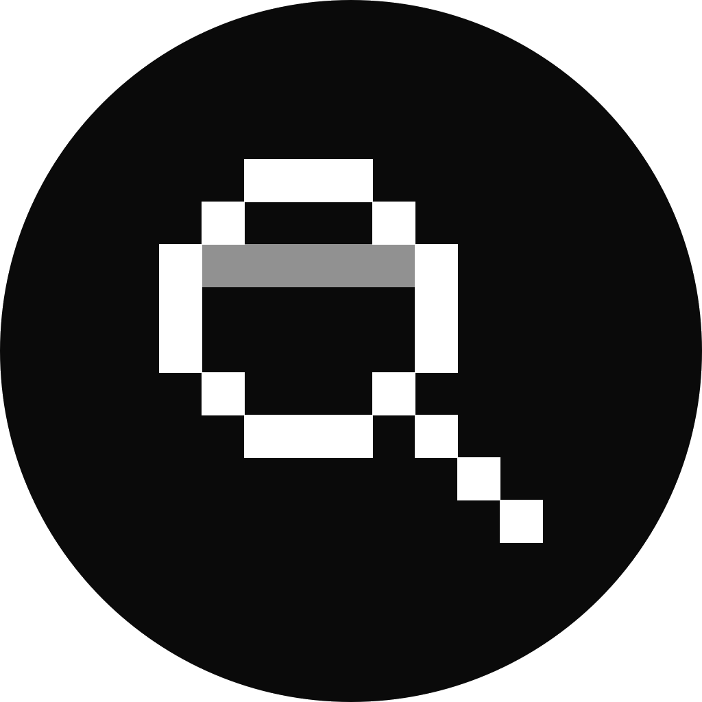

# Reveal logo

The mark used in the nav (`Nav`) and footer (`Footer`) of `app/page.tsx`: a black
circle containing a pixel-art magnifying glass / lens, with an animated scan
line sweeping through it.

## Preview

| Standard (black circle) | Transparent background |
| --- | --- |
|  |  |

## Files

- `public/logo.svg` — vector, scales to any size, background is transparent by default (SVG canvases have no fill unless you add one). Use this wherever possible.
- `public/logo-transparent.png` — 1024×1024 raster export with a transparent background, for places that need a PNG (social cards, app icons, etc).
- `public/logo.png` — original raster export with an **opaque white** background (kept for backwards compatibility).

## Source

```svg
<svg xmlns="http://www.w3.org/2000/svg" width="200" height="200" viewBox="0 0 20 20" shape-rendering="crispEdges">
  <circle cx="10" cy="10" r="10" fill="#0a0a0a" />
  <g transform="translate(4.5 4.5) scale(1.2222)">
    <!-- Lens outline -->
    <rect x="2" y="0" width="3" height="1" fill="white" />
    <rect x="1" y="1" width="1" height="1" fill="white" />
    <rect x="5" y="1" width="1" height="1" fill="white" />
    <rect x="0" y="2" width="1" height="3" fill="white" />
    <rect x="6" y="2" width="1" height="3" fill="white" />
    <rect x="1" y="5" width="1" height="1" fill="white" />
    <rect x="5" y="5" width="1" height="1" fill="white" />
    <rect x="2" y="6" width="3" height="1" fill="white" />
    <!-- Handle -->
    <rect x="6" y="6" width="1" height="1" fill="white" />
    <rect x="7" y="7" width="1" height="1" fill="white" />
    <rect x="8" y="8" width="1" height="1" fill="white" />
    <!-- Scan line -->
    <rect x="1" y="2" width="5" height="1" fill="white" fill-opacity="0.55">
      <animate attributeName="y" values="2;3;4;3;2" dur="2s" repeatCount="indefinite" calcMode="discrete" />
    </rect>
  </g>
</svg>
```

This is the same geometry used inline in `app/page.tsx` (`Nav` and `Footer`),
just recentered inside a full circle instead of relying on a `w-5 h-5
rounded-full` wrapper div. Drop the `<svg>...</svg>` block above into any
`.svg` file, or inline it directly in JSX, to regenerate the mark at any
size — everything is defined in a 20×20 unit grid so it stays crisp.

### Regenerating the transparent PNG

If you change the source and need a fresh transparent raster:

```bash
# render public/logo.svg to a large PNG with e.g. an SVG-to-PNG tool
# (rsvg-convert, resvg, or a headless browser), then confirm alpha:
python3 -c "
from PIL import Image
im = Image.open('public/logo-transparent.png').convert('RGBA')
print(im.getpixel((5, 5)))   # expect (255, 255, 255, 0) — transparent corner
"
```
